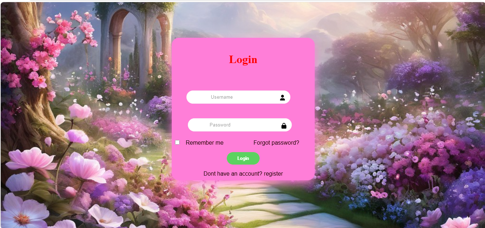

# 🔐 Login Page

A simple and clean **Login Page** built using **HTML**, **CSS**, and **Font Awesome** icons with a pink theme and background image.

## 📸 Screenshot



## 📁 Project Structure

```txt
login-page
│
├── login.html
├── README.md
│
└── assets
    ├── css
    │   └── style.css
    │
    └── img
        └── screenshot.png
```

## 🚀 Features

* Username & Password input fields with Font Awesome icons
* "Remember Me" checkbox
* "Forgot Password?" link
* Login submit button
* "Don't have an account? Register" prompt
* Pink themed card with box shadow
* Background image from CDN

## 🛠️ Technologies Used

* HTML5
* CSS3
* Font Awesome 6.4.0 (CDN)

## ⚙️ Setup & Usage

1. **Clone the repository**

```bash
git clone https://github.com/Monisha71326/login-page.git
```

2. **Navigate to the project folder**

```bash
cd login-page
```

3. **Open in browser**

```bash
open login.html
```

or double-click `login.html`

## 🚀 GitHub Push Commands

```bash
git init
git add .
git commit -m "Initial commit - Login Page"
git branch -M main
git remote add origin https://github.com/Monisha71326/login-page.git
git push -u origin main
```

## 📄 License

This project is open source and available under the MIT License.
